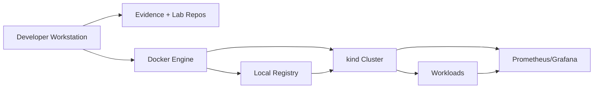

# Home Lab Architecture (Local-First)

This document describes a local-first lab setup that supports the full curriculum: CI simulation, Kubernetes labs, IaC workflows, observability, and safe failure injection.

## Design Goals

- reproducible: you can rebuild the lab from scratch
- isolated: labs do not pollute your host system
- observable: you can see metrics/logs for what you run
- debuggable: you can exec into things and inspect state
- safe: predictable cleanup and bounded resource usage

## Recommended Components

- Git repo(s): your evidence workspace and your lab projects
- Container runtime: Docker
- Local Kubernetes: kind (preferred) or minikube
- Local container registry: registry container (optional but recommended)
- CI simulation: Makefile-based pipeline runner and a local runner container (later)
- IaC: Terraform local workflow; optional remote-state simulation as an exercise
- Config mgmt: Ansible (local inventory) and SSH to VMs/containers where appropriate
- Observability: Prometheus + Grafana locally; log shipping optional later

## Baseline Topology

## Operating Conventions

- Use a dedicated Kubernetes cluster name per module/project to avoid cross-contamination.
- Use namespaces per lab; avoid `default` once workloads grow beyond trivial.
- Use resource limits for pods and containers in labs that could runaway.
- Treat your workstation like production: track changes and write runbooks.

## Failure Injection Patterns (Safe and Useful)

- config errors: wrong env var, bad config file, invalid YAML
- dependency errors: wrong DNS name, blocked port, expired TLS cert (simulated)
- resource pressure: low memory limits → OOMKilled, disk filled (bounded, reversible)
- rollout issues: wrong image tag, wrong label selector, bad readiness probe

## Evidence and Observability Defaults

Every lab should produce at least:

- a health check (curl, synthetic request, or probe)
- a log sample that proves success and failure states
- one metric to watch during failure injection (e.g., error rate or restarts)

How to evaluate: [04-evidence-rubrics.md](04-evidence-rubrics.md)

## Cleanup Discipline

You should be able to “return to clean” quickly:

- remove kind clusters not in use
- delete unused Docker images/volumes created by labs
- ensure no background processes keep consuming resources

Safety guidance: [03-lab-safety-cost-control.md](03-lab-safety-cost-control.md)
